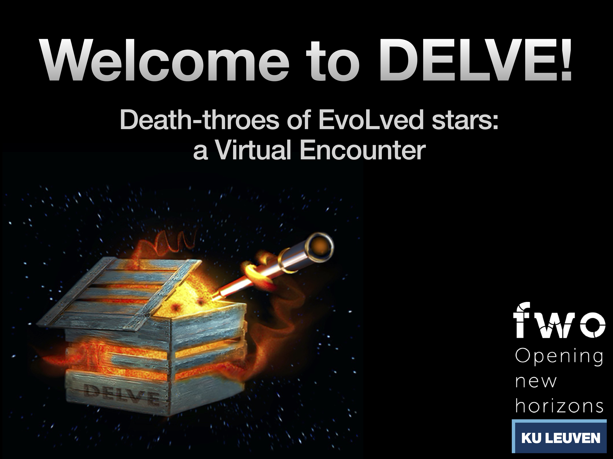
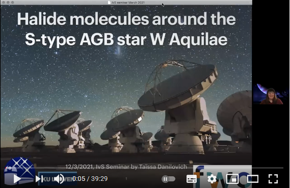

# Outreach

### Astronomy on Tap, Bonn 2021
I spoke about molecules around dying stars: [Link](https://www.youtube.com/watch?v=DiPoVfm9QhQ)

### Jodcast Interview	2020  
I was interviewed for the University of Manchester’s popular astronomy podcast, the Jodcast: [Link](http://www.jodcast.net/archive/202011/)

# Scientific talks online

### July 2024, “The Salty and Dusty Winds of Intermediate-mass AGB stars”, ACES: Advances in Cool Evolved Stars, Melbourne, Australia

[Click here to view](https://youtu.be/xLodr-p7vpw)

### September 2023, “Isotopic ratios from (sub)millimetre observations of AGB stars”, Nuclei in the Cosmos XVII, Daejeon, South Korea

[Click here to view](https://u.pcloud.link/publink/show?code=XZk4icVZdPw2VsJGV9kRqoWXXpJ9sVF4zkL7)

### July 2023, “Using astrochemistry to understand orbital properties of AGB stars”, Annual Scientific Meeting of the Astronomical Society of Australia, Sydney, Australia

[Click here to view](https://www.dropbox.com/scl/fo/u4ltsiigp58la88ctc9fa/h/DAY%202/T2/Day%202_Session%207B.3_Taïssa%20Danilovich.mov?rlkey=amzaq17vsae1m4esvlgar2m0k&e=1&dl=0)

### June 2023, “Chemical Tracers of an Eccentric Binary Orbit”, Seminar, Monash University, Melbourne, Australia

[Click here to view](https://www.youtube.com/watch?v=FuhILOTEYgw)

### February 2023, “Wind shaping and other observational tracers of binary companions to AGB stars”, Phantom and MCFOST Users Workshop, Melbourne, Australia (video)

[Click here to view](https://youtu.be/KLMGt0AMpDM)

### November 2021, “The distribution of carbonaceous molecules and SiN around the S-type AGB star W Aql”, IAU Symposium 366: The origin of outflows in evolved stars, Online

[Click here to view](https://www.youtube.com/watch?v=3f79c8nUPsU&list=PLrGAIWCGSKlA1lreL7a4tLd_chHL0nRa1&index=7&t=4067s)

### June 2021, “Circumstellar structure & dust formation” (invited talk), GAPS 2021 – unsolved problems in red Giants And suPergiantS, Online

Click on the image below to view on YouTube

### April 2021, “Halide molecules around the S-type AGB star W Aquilae”, DELVE: Death-throes of EvoLved stars, a Virtual Encounter, Online 

Click on the image below to view on YouTube

### March 2021, “Halide molecules around the S-type AGB star W Aquilae”, Seminar, KU Leuven, Belgium  

Click on the image below to view on YouTube

  

### June 2020, “Metal oxides around R Dor: a tale of dust precursors”, Astrochemical Frontiers — Quarantine Edition, Online 

[Video available here](https://harvard.zoom.us/rec/play/Va4QP2rsTVBDhjQWahuLON4Ueer-6eQgqxO6cz1h6TrPOSQqrNCeu9B5vLCOZLAz1zRuQyb5vxViylcJ.Rupfny5yW3i2afdq?continueMode=true&_x_zm_rtaid=aftFOQLpT8uDfgO8aKDicw.1619019940901.02161291930e40b8f6327a47ad77e0f0&_x_zm_rhtaid=589), talk starts at 04:31 minutes

# Publications

My full publication list can be accessed via ADS: [ADS Link](http://tiny.cc/TDanilovichADS)
