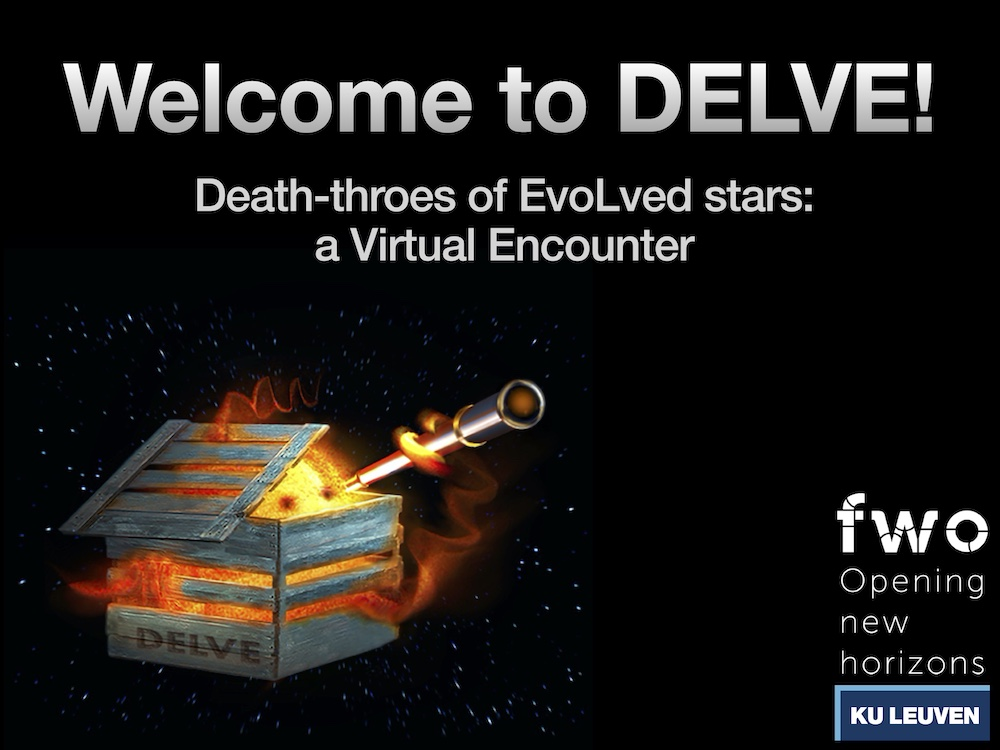

# Outreach

### Jodcast Interview	2020  
I was interviewed for the University of Manchester’s popular astronomy podcast, the Jodcast: [Link](http://www.jodcast.net/archive/202011/)

# Scientific talks online

### April 2021, “Halide molecules around the S-type AGB star W Aquilae”, DELVE: Death-throes of EvoLved stars, a Virtual Encounter, Online 

Click on image below to view on YouTube

### March 2021, “Halide molecules around the S-type AGB star W Aquilae”, Seminar, KU Leuven, Belgium  
  

### June 2020, “Metal oxides around R Dor: a tale of dust precursors”, Astrochemical Frontiers — Quarantine Edition, Online 
([video](https://harvard.zoom.us/rec/play/Va4QP2rsTVBDhjQWahuLON4Ueer-6eQgqxO6cz1h6TrPOSQqrNCeu9B5vLCOZLAz1zRuQyb5vxViylcJ.Rupfny5yW3i2afdq?continueMode=true&_x_zm_rtaid=aftFOQLpT8uDfgO8aKDicw.1619019940901.02161291930e40b8f6327a47ad77e0f0&_x_zm_rhtaid=589), talk starts at 04:31 minutes)

# Publications

My full publication list can be accessed via ADS: [ADS Link](http://tiny.cc/TDanilovichADS)
